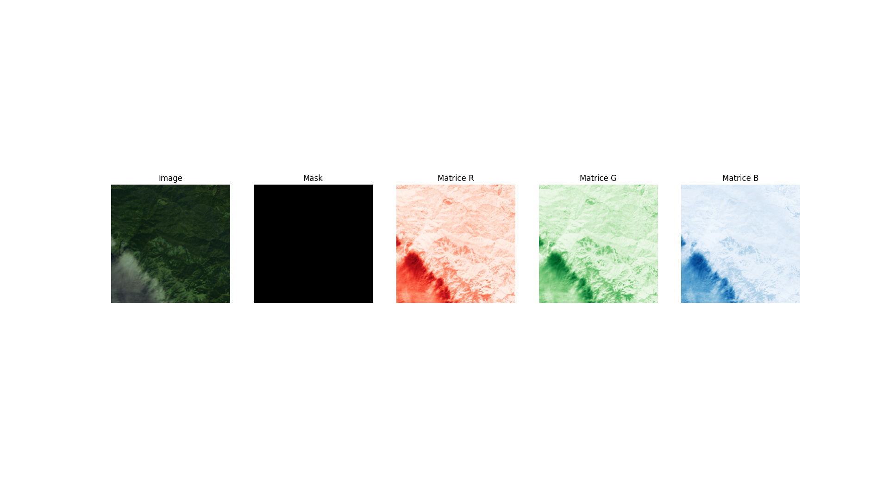
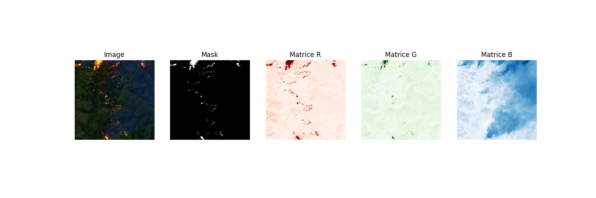
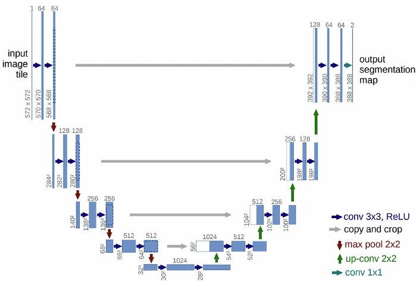
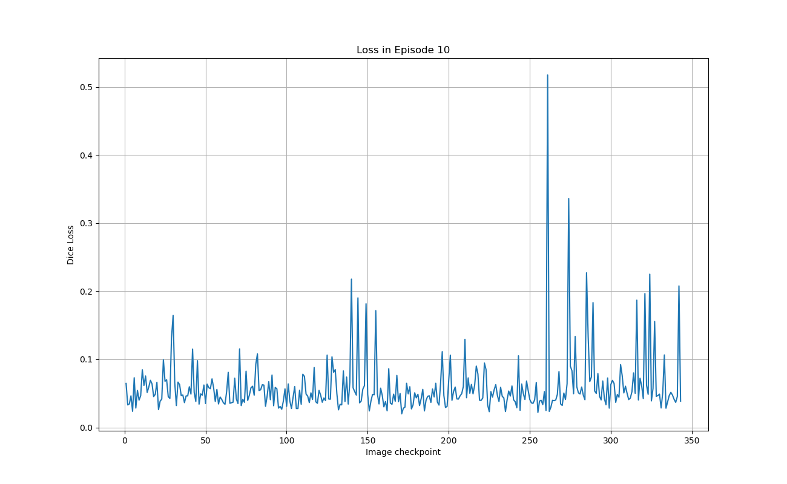
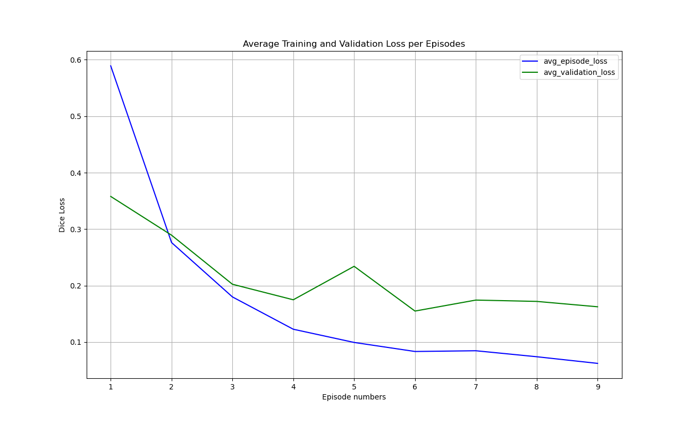
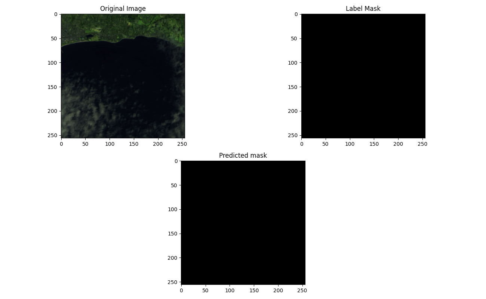
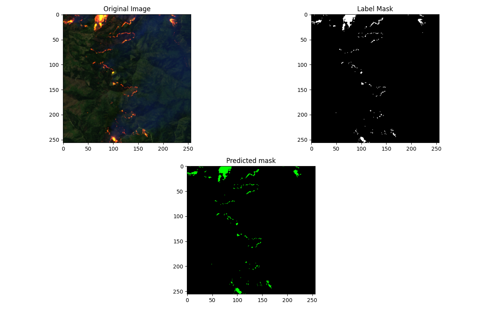
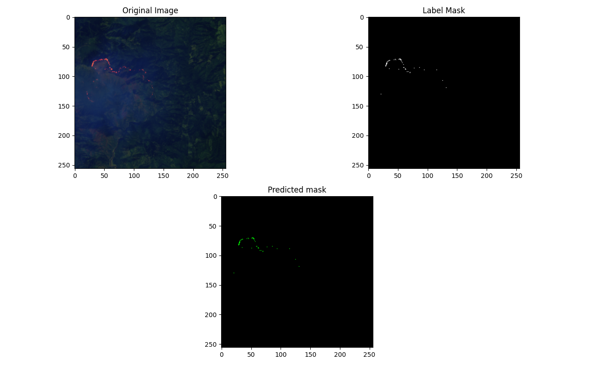
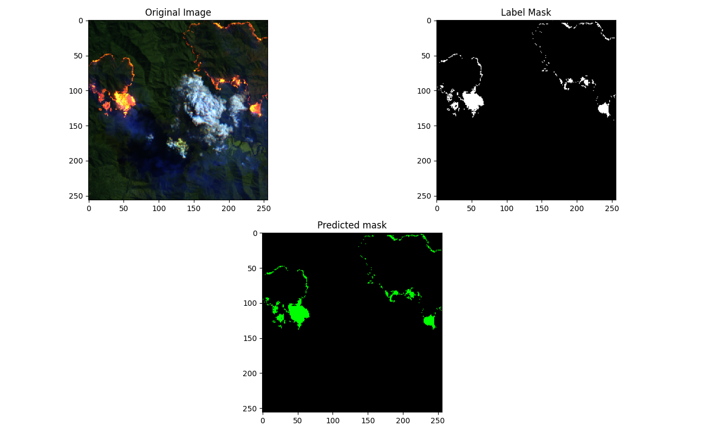
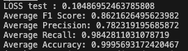

# U-NET DÉTECTION DE FEUX DE FORÊT PAR SÉGMENTATION D'IMAGE SATELLITE 🛰️

##  🏁 Description
SAT_FIRE_DETECTION est un projet de Computer Vision visant à entraîner un réseau de neuronne à convolution U-Net afin de détecter les feux de forêt par segmentation d'images satellites. 

- Algorithme : Le projet met en œuvre un réseau de neurones à convolution (CNN) basé sur l'architecture U-Net. Cette dernière est particulièrement performante pour les tâches de segmentation d'images, ce qui permet de délimiter avec précision les zones de feu sur les images satellites.

- Dataset : Le modèle U-Net est entraîné sur le dataset créé et annoté par l'IRT Saint Exupéry, disponible à cette adresse : https://www.irt-saintexupery.com/fr/firesat/

## ⭐️ Fonctionnalités et Architecture 
Cette section détaille les choix techniques et l'implémentation spécifique du réseau de neuronne à convolution U-net.

### 🧠 Pré-traitement et Modèle d'Apprentissage
- 🖼️ **Pré-traitement des données** :
    - Lecture des noms d'images et de masques depuis les fichiers `train.txt` pour l'entraînement `val.txt` pour la validation lors de l'entraînement,  et `test.txt` pour le test finale de notre modèle après entraînement. 
    - Chargement des images, séparation des canaux RVB et normalisation des valeurs de pixels entre 0 et 1.
    - Standardisation des données (moyenne=0, écart-type=1) pour accélérer la convergence.
    - Récupération du `Mask` (label) associé à chaque images.
    - Organisation des données en tenseurs prêts pour l'entraînement.


- 🏗️ **Architecture du modèle U-Net** :
    - **Structure en U** : Le réseau adopte une architecture symétrique composée d'une partie contractante (encodeur) et d'une partie expansive (décodeur).
    - **Encodeur** : La partie gauche (contractante) utilise des blocs de convolutions suivis de Max-Pooling pour réduire progressivement la dimension spatiale des images et extraire des caractéristiques de plus en plus complexes.
    - **Décodeur** : La partie droite (expansive) utilise des convolutions transposées (`ConvTranspose2d`) pour sur-échantillonner les cartes de caractéristiques et reconstruire une segmentation fine à la résolution d'origine.
    - **Connexions de saut (Skip Connections)** : Des connexions directes relient les couches de l'encodeur à leurs homologues du décodeur. Elles permettent au modèle de réutiliser les informations spatiales de bas niveau (contours, textures) perdues lors de la contraction, améliorant considérablement la précision de la segmentation.
    - **Sortie** : La couche finale utilise une convolution de taille 1x1 suivie d'une fonction d'activation **Sigmoid**. Cela produit une carte de probabilité où chaque pixel a une valeur entre 0 et 1, indiquant la probabilité qu'il appartienne à la classe "feu".


- 🛑 **Stratégie anti-surapprentissage (Early Stopping)** : Pour éviter le surapprentissage, une technique d'arrêt anticipé est mise en place. L'entraînement est interrompu si la perte de validation ne s'améliore pas pendant un nombre défini d'époques (patience de 3). Le modèle avec la meilleure performance de validation est sauvegardé.

- 🎲 **Fonction de Perte (Dice Loss)** :
    - La perte est calculée à l'aide du **Dice Loss** (`1 - Dice Coefficient`), une mesure idéale pour les tâches de segmentation.
    - Le Dice Coefficient mesure la similarité entre la prédiction et le masque réel (vérité terrain), avec une valeur de 1 pour une correspondance parfaite.
    - Cette fonction de perte est particulièrement efficace pour les datasets déséquilibrés (comme ici, où les pixels de "feu" sont rares par rapport au fond), car elle se concentre sur la correspondance spatiale des régions d'intérêt plutôt que sur la précision pixel par pixel.

### ⚙️ Optimisation Multiplateforme :
Le code est optimisé pour une exécution accélérée sur différentes architectures matérielles avec détection automatique de la plateforme :

- Apple Silicon (Mac M1/M2/M3) : Utilisation de l'API Metal Performance Shaders (MPS) pour l'accélération GPU.

- NVIDIA (Windows/Linux) : Utilisation de l'API CUDA pour l'accélération GPU, lorsque disponible.

- CPU (Générique) : Bascule automatique sur le CPU lorsque ni MPS ni CUDA n'est détecté.

## 🛠️ Prérequis et installation

### ⚙️ Prérequis Logiciels : 
Assurez vous d'avoir : 
   - Python 3.11 (pour meilleure compatibilité avec Pytorch)

### 💿 Cloner le dépôt :
   - Avec HTTPS : 
   ```bash
   git clone https://github.com/Belou25/sat_fire_detection.git
   ```
   - Avec SSH : 
   ```bash 
    git clone git@github.com:Belou25/sat_fire_detection.git
   ```

### 🐍 Installation des Dépendances Python :

Une fois les prérequis système installés (si nécessaire), vous pouvez installer toutes les bibliothèques Python :

1. Créez et activez un environnement virtuel (recommandé) :

```bash
python3.11 -m venv env
source env/bin/activate
```

2. Installez les bibliothèques à partir du fichier requirements.txt :
```bash
pip install -r requirements.txt
```

## 🕹️ Utilisation et Entraînement
### Entraîner le modèle : 
Pour démarrer l'entraînement du modèle : 
```bash
python fire_detect_train.py
```

### Visualiser le modèle entraîné : 
Pour visualiser et tester le modèle :

```bash 
python fire_detect_test.py
```


## 🏛️ Structure du projet
- `fig_readme/`: dossier contenant certaines images d'illustration du `README.md` 
- `figures/in_episode/`: dossier contenant les graphiques de suivi du `Dice loss`  pour chaque batch de chaque épisode.
- `figures/out_episode/`: dossier contenant le graphique de suivi du `Dice loss` moyen sur les données d'entraînements (Training loss) et de train-test(Validation loss) par épisodes. 
- `Model_save_weights/`: dossier contenant le poid du modèle entrainé (mis à jour à chaque fin d'épisode).
- `Model_save_weights/model_weights2.pth`: poids d'un modèle entrainé fonctionnel. 
- `fire_detect_test.py`: fichier python pour visualisation du modèle entraîné.
- `fire_detect_train.py`: fichier python pour entraînement du modèle. 
- `présentation_detection_feux_forêts.pdf`: Rapport du projet.
- `requirements.txt` : liste des frameworks utiles pour l'environemment. 


## 📈 Résultats 
- **Graphiques de Convergence** : 



- **Images de visualisation des prédictions sémantiques du modèle** :





- **Résutats de validation sur le Dataset de Test** :  


- **Rapport du projet** : 
Un rapport du projet est diponible dans le dépôt au nom de : `présentation_detection_feux_forêts.pdf`.

## 💾 Détails de l'Entraînement Initial (Poids Fournis)
Les poids du modèle pré-entraîné (`model_weights2.pth`) fournis dans ce dépôt ont été générés dans l'environnement matériel suivant :

- GPU : NVIDIA GeForce RTX 3070 (version portable)

- VRAM Dédée : 8 Go

- RAM Système : 16 Go

- Période d'Entraînement : 25 minutes (10 épisodes) sur une seule session.

- Batch Size Utilisé : L'entraînement a été effectué avec un petit batch size de 8 pour rester dans la limite des 8 Go de VRAM et garantir la stabilité.


## 💡 Recommendation pour un Nouvel Entraînement 

Pour quiconque souhaite réentraîner l'agent sur une machine différente, il est essentiel d'ajuster les hyperparamètres et de surveiller l'utilisation du matériel pour maximiser l'efficacité.

1. Adapter la Taille du Batch (`Batch Size`)

La taille du batch de 8, utilisée lors de l'entraînement initial, est conservatrice. Si votre machine le permet (plus de 8 Go de VRAM), il est fortement recommandé d'augmenter le `Batch Size` pour accélérer la convergence.

2. Ajuster le Taux d'Apprentissage (`Learning Rate`)

Lorsque vous augmentez le `Batch Size`, le gradient de la fonction de perte devient plus stable et précis. Pour exploiter cette précision, vous devez augmenter le `Learning Rate` ($\alpha$) pour éviter une convergence trop lente. 

3. Surveillance de la Saturation GPU/VRAM

Pour vous assurer que vous utilisez au maximum la puissance de votre carte graphique sans dépasser la mémoire, vous devez viser une saturation du GPU/VRAM de 90% ou plus.

- Windows : Gestionnaire des tâches.
- MacOS :
```bash 
sudo powermetrics --samplers cpu_power,gpu_power -i 500
```

## 🙋‍♂️ Auteur
- Erwan GOURIOU
